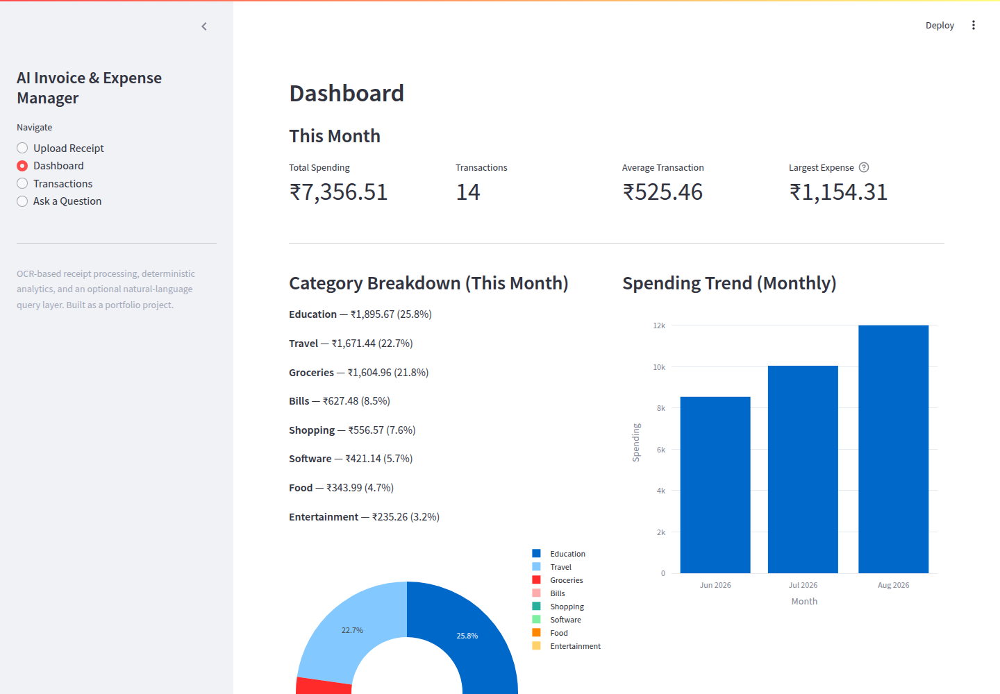
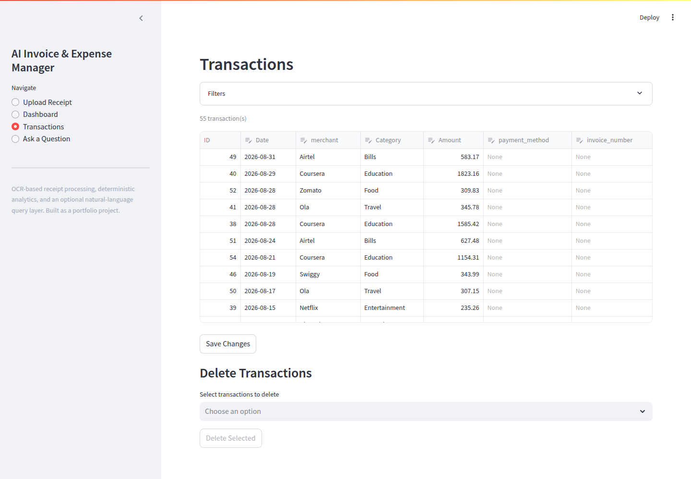
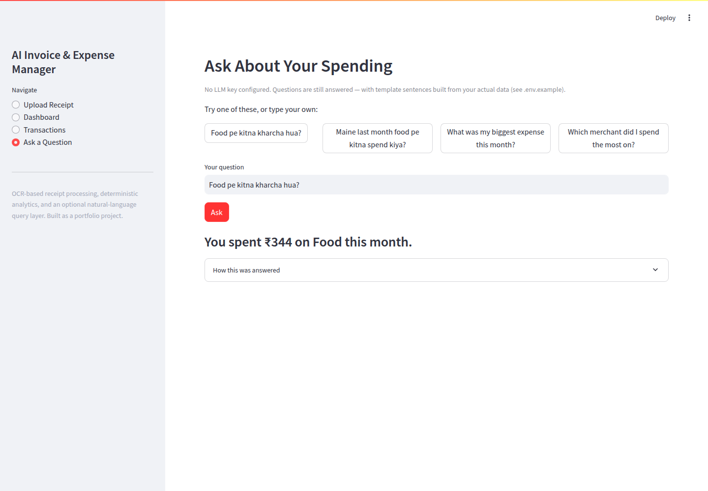
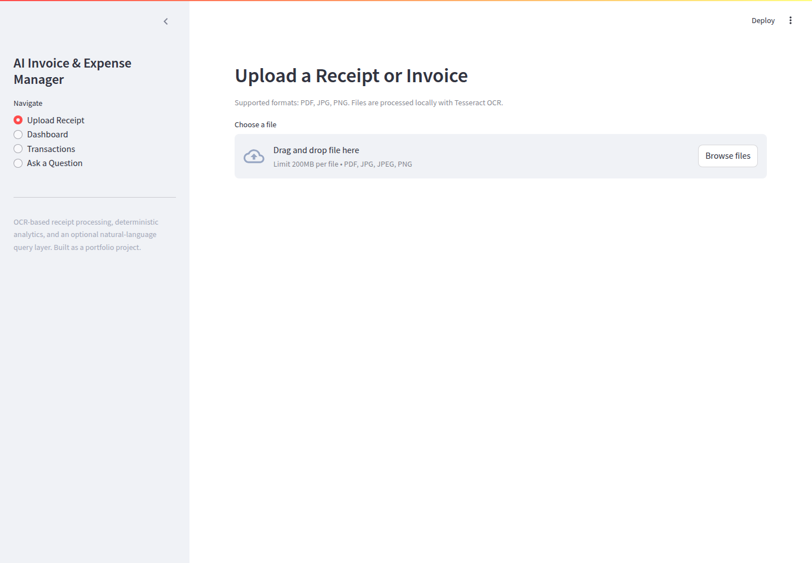
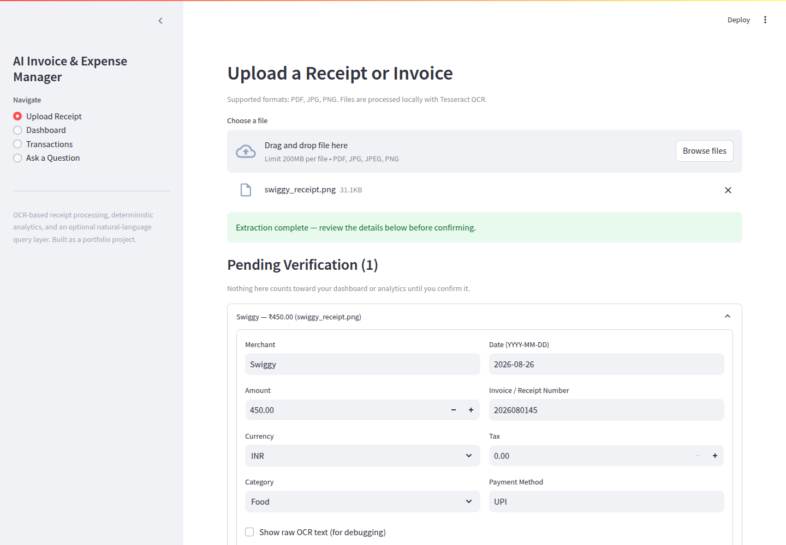

# AI Invoice & Expense Manager

A web app that turns a photo or PDF of a receipt into a categorized
transaction, and answers questions about a user's spending — using OCR,
a rule-based (plus optional ML) categorization pipeline, and deterministic
analytics. A natural-language query layer sits on top and works with or
without an LLM API key.

Built as a portfolio project. See `docs/LIMITATIONS.md` for an honest
list of what this does and doesn't do well.

## Problem

Manually tracking expenses from paper/PDF receipts is tedious enough that
most people don't do it. Existing tools either require manual entry or
treat OCR as a black box that just works — with no visibility into where
extraction is confident vs. guessing.

## Solution

Upload a receipt. The app runs it through OCR, extracts the merchant,
amount, date, and other fields with regex-based heuristics, normalizes
the merchant name, and suggests a category. Nothing is saved as "real"
data until the user reviews and confirms it. Confirmed transactions feed
a dashboard of deterministic analytics (totals, category breakdowns,
trends, and specific data-backed insight sentences) and can be queried in
plain English or Hinglish.

## Features

- Upload PDF/JPG/PNG receipts with file-type, size, and corruption
  validation.
- OCR (Tesseract) with image preprocessing tuned for phone-photo
  receipts.
- Regex/heuristic extraction of merchant, amount, currency, date,
  invoice number, tax, subtotal, and payment method — with a confidence
  score and graceful handling of missing fields.
- A human verification screen: every extraction is editable and must be
  explicitly confirmed before it affects analytics.
- Merchant name normalization (corporate-suffix stripping + a small alias
  table + fuzzy matching against known merchants).
- Two-tier categorization: a transparent rule-based baseline (default) and
  an optional ML classifier shown as a secondary suggestion — see
  `docs/ML_PIPELINE.md`.
- A dashboard: this-month overview, category breakdown, monthly spending
  trend, and insight sentences computed from real data.
- A filterable, editable transaction table (edit, delete, recategorize).
- An "Ask a Question" page: natural-language queries (English/Hinglish)
  answered by a deterministic query engine, optionally reworded by an
  LLM if one is configured — never used to compute the number itself.

## Demo

Run locally (see Installation below) — there is no hosted live demo.

## Screenshots

| Dashboard | Transactions |
|---|---|
|  |  |

| Ask a Question | Upload |
|---|---|
|  |  |

**OCR extraction + verification screen** (a real upload of
`sample_receipts/swiggy_receipt.png`, processed by the actual OCR
pipeline):



## Architecture

```
receipt file
  -> validation (type, size, corruption)
  -> OCR (Tesseract, with preprocessing)
  -> text cleaning
  -> field extraction (regex/heuristics)
  -> merchant normalization
  -> categorization (rules, + optional ML suggestion)
  -> human verification (edit + confirm)
  -> SQLite
  -> analytics (pandas, deterministic)
  -> dashboard / insights / natural-language query answers
```

Full writeup, including why each architectural decision was made, in
`docs/ARCHITECTURE.md`.

## OCR Pipeline

Tesseract + OpenCV preprocessing (grayscale, upscaling, denoising,
adaptive thresholding). Chosen for running fully offline with no API key,
being well documented, and being sufficient for printed receipts — not
positioned as state-of-the-art. Full writeup, including known failure
cases, in `docs/OCR_PIPELINE.md`.

## Information Extraction

Regex-based extraction of merchant, amount (prioritizing labeled totals
over subtotal/tax/line items, with a flagged fallback when no label
matches), currency, date (multiple formats, normalized to ISO 8601),
invoice number, tax, subtotal, and payment method. Missing fields are
returned as `None`, never guessed. See `app/extraction/fields.py`.

## Categorization

Rule-based merchant/keyword lookup by default; an optional TF-IDF +
Logistic Regression classifier trained on a small synthetic dataset is
shown as a secondary suggestion. Full reasoning, dataset description, and
**actual measured metrics** in `docs/ML_PIPELINE.md` and
`docs/ML_METRICS.md`.

## Analytics

Every number on the dashboard and every insight sentence is computed
directly from confirmed transactions via pandas — monthly/weekly totals,
category breakdowns, percentage changes, merchant concentration. No LLM
involved. See `app/analytics/`.

## LLM Architecture

Fully optional. Works from a rule-based intent parser (handles the
product's example English/Hinglish questions) and the same deterministic
analytics functions the dashboard uses. An LLM, if `OPENAI_API_KEY` is
set, only rewords the already-computed answer — it is never asked to
calculate a number, and a failed LLM call falls back to the template
answer. Full writeup in `docs/LLM_ARCHITECTURE.md`.

## Tech Stack

- **UI**: Streamlit
- **OCR**: Tesseract (`pytesseract`), `pdf2image` (PDF -> image),
  OpenCV + Pillow (preprocessing)
- **Data**: pandas
- **ML**: scikit-learn (TF-IDF + Logistic Regression)
- **Database**: SQLite (`sqlite3`, no ORM)
- **Charts**: Plotly
- **Optional LLM**: OpenAI API, behind a provider interface
- **Testing**: pytest

## Project Structure

```
ai-invoice-expense-manager/
  app/
    ui/              Streamlit pages
    ocr/              validation -> preprocessing -> Tesseract wrapper
    extraction/        text cleaning + regex field extraction
    normalization/      merchant name normalization
    classification/      rule-based categorizer + optional ML classifier
    analytics/            deterministic aggregation + insights
    llm/                  optional pluggable LLM layer + query engine
    database/              sqlite3 schema + repository functions
    models/                  shared Transaction dataclass
    utils/                    validators, formatting
  tests/                one test module per app/ package (53 tests)
  data/                 app.db (gitignored), training_data.csv, classifier_model.pkl
  sample_receipts/      synthetic receipt images for demo/testing
  scripts/               generate sample data, train the classifier, capture screenshots
  docs/                   architecture + pipeline documentation
  screenshots/             real screenshots of the running app
  main.py                  Streamlit entry point
```

## Installation

Requires Python 3.11+, and Tesseract + Poppler installed system-wide.

```bash
# System dependencies (Debian/Ubuntu)
sudo apt-get install tesseract-ocr poppler-utils

# macOS
brew install tesseract poppler

# Python dependencies
pip install -r requirements.txt
```

## Environment Variables

Copy `.env.example` to `.env`. Every variable is optional:

```
OPENAI_API_KEY=      # unset by default — the app works fully without it
OPENAI_MODEL=gpt-4o-mini
DATABASE_PATH=data/app.db
```

## Running Locally

```bash
# One-time: generate synthetic sample data
python scripts/generate_sample_receipts.py     # sample_receipts/*.png
python scripts/generate_training_data.py       # data/training_data.csv
python scripts/train_classifier.py             # data/classifier_model.pkl, docs/ML_METRICS.md
python scripts/seed_sample_transactions.py     # populates the dashboard with demo data

# Run the app
streamlit run main.py
```

Then open the URL Streamlit prints (typically `http://localhost:8501`).
Upload a file from `sample_receipts/` on the Upload page to see the OCR
pipeline run end-to-end.

## Testing

```bash
pytest tests/ -v
```

53 tests covering extraction (amount/date/merchant/currency), merchant
normalization, categorization, analytics (totals, percentage changes,
insights), the natural-language query parser and query engine, the
database repository layer, and upload validation — including edge cases
(empty data, missing fields, malformed/oversized/corrupted uploads).

## Deployment

See `docs/DEPLOYMENT.md` for a Streamlit-Community-Cloud deployment guide
and production considerations (SQLite's single-writer limitation, secrets
configuration, etc.).

## Limitations

See `docs/LIMITATIONS.md` for the full, honest list — OCR failure cases,
extraction edge cases, categorization boundaries, and what wasn't tested
(the OpenAI provider path has not been exercised against a live key in
this environment; no API key was available during development).

## Future Improvements

See `docs/LIMITATIONS.md` — recurring-expense detection, budget alerts,
GST-specific extraction, retraining the classifier on real confirmed
history, bank-statement/email ingestion, multi-user auth.

## Privacy Considerations

- Receipts can contain sensitive financial information. `data/app.db`
  and any uploaded files are gitignored — never commit them.
- No transaction data is sent anywhere by default (the LLM layer is
  opt-in via `OPENAI_API_KEY`, and even then only receives a single
  already-computed answer sentence to reword — not raw transaction data).
- `.env` is gitignored; only `.env.example` (with no real values) is
  committed.
- This repository's sample data (`sample_receipts/`, seeded demo
  transactions) is entirely synthetic — no real receipts or real
  financial data were used anywhere in this project.

## Interview Preparation Guide

`docs/interview_prep/Interview_Prep_Guide.pdf` — pitches (30-second and
2-minute), full architecture, a code walkthrough of the major files, a
curated interview Q&A bank (~65 questions across 10 categories, full
depth), and three versions of CV bullet points. Built from
`docs/interview_prep/content.py` and `qa_bank.py` — regenerate with
`python docs/interview_prep/build_guide.py`.

## Author

Built by Akhilesh as a portfolio project.
